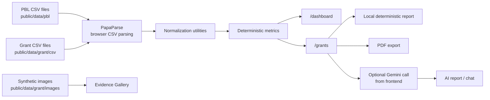
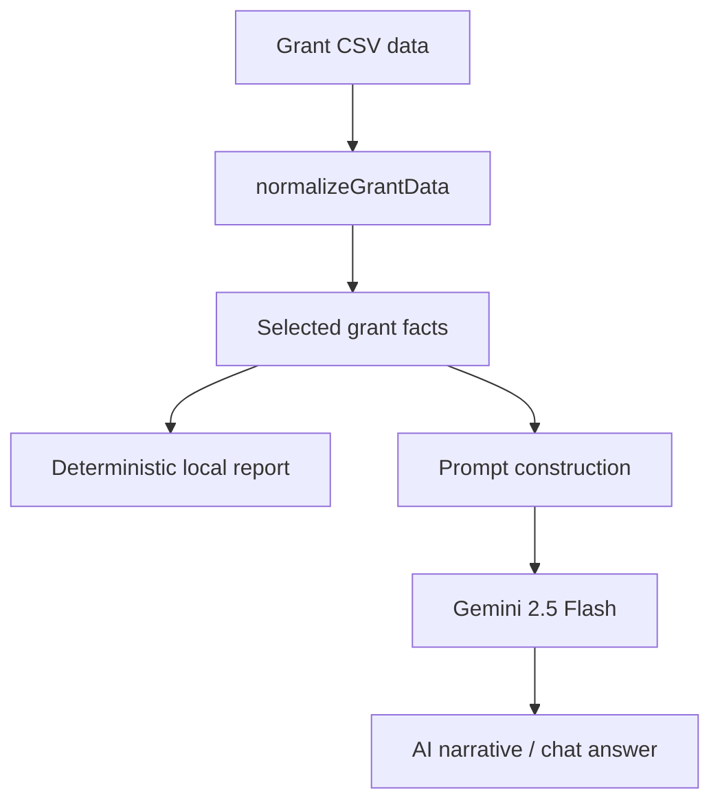

# Mantra4Change PBL Intelligence & Grant Reporting Assistant


## Overview

Mantra4Change PBL Intelligence & Grant Reporting Assistant is a static React + Vite dashboard built for the **Mantra4Change AI Prework Assignment**. It directly reads synthetic CSV files from the `public/data` folder, parses them in the browser, and converts them into program intelligence dashboards, grant reporting summaries, evidence views, deterministic reports, optional AI narratives, and PDF exports.

There is **no backend server** and **no database** in this project. The complete implemented application runs in the frontend.

## What It Solves

The app helps program, monitoring, evaluation, and grant reporting teams quickly answer:

- How are schools performing across PBL participation, evidence submission, attendance, and risk?
- Which districts or schools need follow-up?
- How are grants performing across budget utilization, completion, attendance, risk, and evidence?
- Can the available structured data be converted into donor-ready report material?

## Features

### PBL Program Dashboard

- Dashboard route at `/dashboard`.
- KPI cards for total schools, participating schools, participation rate, evidence submission rate, total enrollment, total attendance, average attendance, and critical / at-risk counts.
- Filters for school search, month, district, block, grade, subject, and risk status.
- Month-over-month deltas when a single month after July is selected.
- Attendance trend chart.
- Risk distribution chart.
- District participation comparison chart.
- Paginated school table with participation, evidence, enrollment, attendance, and risk status.

### Grant Reporting

- Grant reporting route at `/grants`.
- Grant selector and reporting-month selector.
- KPI cards for grants, total budget, utilized amount, utilization rate, and submitted reports.
- Budget utilization chart.
- Evidence gallery using synthetic images from `public/data/grant/images`.
- Grant summary with donor, reporting month, report status, budget, utilization, completion, attendance, and risk.
- Deterministic fact report generated locally from CSV-derived grant data.
- Copy-to-clipboard for reports.
- PDF export using `jsPDF`.

### AI-Assisted Features

- Optional Gemini-powered grant narrative generation.
- Optional grant-specific AI chat.
- AI prompts are built from selected grant facts and instruct the model to use only supplied data.
- Deterministic report generation works even when no AI key is configured.

## Tech Stack

| Area | Implementation |
| --- | --- |
| App | Static frontend application |
| Framework | React 19 |
| Build Tool | Vite 8 |
| Styling | Tailwind CSS |
| Routing | React Router DOM |
| Charts | Recharts |
| CSV Parsing | PapaParse |
| AI | Google Gemini via `@google/generative-ai` |
| PDF Export | jsPDF |
| Icons | React Icons, Lucide React dependency present |
| Backend | Not used |
| Database | Not used |
| Authentication | Not implemented |

## Architecture

The app is intentionally simple: Vite serves static CSV and image files, and the React app parses and analyzes them in the browser.



## Data Flow

1. CSV files are stored in `public/data`.
2. The browser downloads CSV files as static assets.
3. `Papa.parse` parses CSV rows with headers.
4. Normalization utilities convert raw CSV columns into app-friendly objects.
5. Helper utilities calculate dashboard and grant metrics in memory.
6. React renders KPIs, charts, tables, evidence cards, and reports.
7. Optional AI actions send selected grant facts to Gemini from the frontend.

## Folder Structure

```text
.
+-- public/
|   +-- data/
|   |   +-- grant/
|   |   |   +-- csv/
|   |   |   +-- images/
|   |   +-- pbl/
|   +-- favicon.svg
|   +-- icons.svg
+-- src/
|   +-- components/
|   |   +-- ai/
|   |   +-- charts/
|   |   +-- dashboard/
|   |   +-- filter/
|   |   +-- grant/
|   |   +-- tables/
|   +-- context/
|   +-- hooks/
|   +-- layout/
|   +-- pages/
|   +-- services/
|   +-- types/
|   +-- utils/
+-- index.html
+-- package.json
+-- package-lock.json
+-- tailwind.config.js
+-- vite.config.js
+-- README.md
```

## Key Source Files

| File | Purpose |
| --- | --- |
| `src/App.jsx` | Defines implemented routes |
| `src/pages/Dashboard.tsx` | PBL dashboard page |
| `src/pages/GrantAssistant.tsx` | Grant reporting page |
| `src/services/csvService.ts` | Shared CSV loader using PapaParse |
| `src/services/grantService.ts` | Loads grant CSV files |
| `src/services/aiConfig.ts` | Configures Gemini model |
| `src/services/aiService.ts` | AI grant report prompt and call |
| `src/services/aiChatService.ts` | AI grant chat prompt and call |
| `src/utils/normalizeData.ts` | Normalizes PBL CSV rows |
| `src/utils/normalizeGrantData.ts` | Joins grant finance, performance, and evidence rows |
| `src/utils/dashboardHelpers.ts` | Calculates PBL dashboard metrics |
| `src/utils/grantDashboardHelpers.ts` | Calculates grant KPIs |
| `src/utils/reportGenerator.ts` | Generates deterministic grant report |
| `src/utils/pdfGenerator.ts` | Exports report text as PDF |

## Data Sources

### PBL Data

```text
public/data/pbl/PBL_School_Response_Data_July_2025.csv
public/data/pbl/PBL_School_Response_Data_August_2025.csv
public/data/pbl/PBL_School_Response_Data_September_2025.csv
```

These files contain school, district, block, participation, evidence submission, grade, subject, enrollment, attendance, derived attendance rate, and derived risk status fields.

### Grant Data

```text
public/data/grant/csv/01_Grant_Profile_and_Finance.csv
public/data/grant/csv/02_Grant_Performance_and_Report_Material.csv
public/data/grant/csv/03_Evidence_and_Media_Index.csv
```

These files contain grant profile, finance lines, performance metrics, milestone summaries, draft report text, evidence records, and image metadata.

### Evidence Images

```text
public/data/grant/images/
```

Images are synthetic assessment assets referenced by the grant evidence CSV.

## Environment Variables

| Variable | Required | Description |
| --- | --- | --- |
| `VITE_GEMINI_API_KEY` | Optional | Enables Gemini-powered AI report generation and grant chat. The rest of the app works without it. |

Example `.env`:

```bash
VITE_GEMINI_API_KEY=your_gemini_api_key
```

Because this is a frontend-only app, any `VITE_` variable is exposed to the browser bundle. Do not use this pattern for production secrets.

## Setup

### Quick Start

Run these commands in order on a fresh machine:

```bash
git clone <repository-url>
cd mantra-dashboard
npm install
npm run dev
```

After `npm run dev`, open the local Vite URL shown in the terminal, usually `http://localhost:5173`.

### Prerequisites

- Node.js 20 or newer is recommended.
- npm.

Check your local versions:

```bash
node --version
npm --version
```

### 1. Clone the Repository

```bash
git clone <repository-url>
cd mantra-dashboard
```

### 2. Install Dependencies

Dependencies are not committed to the repository. Install them before running the app:

```bash
npm install
```

If you want a clean, lockfile-based install, use:

```bash
npm ci
```

### 3. Configure Environment Variables

AI features are optional. The dashboard, CSV analytics, deterministic grant report, and PDF export work without an API key.

To enable Gemini AI report generation and grant chat, create a `.env` file in the project root:

```bash
VITE_GEMINI_API_KEY=your_gemini_api_key
```

### 4. Verify Data Files

The app reads CSV and image files directly from `public/data`. Keep these files in place:

```text
public/data/pbl/
public/data/grant/csv/
public/data/grant/images/
```

### 5. Start the Development Server

Run this only after dependencies are installed:

```bash
npm run dev
```

Open the Vite URL shown in the terminal, usually:

```text
http://localhost:5173
```

No backend setup, database setup, migration, seed command, or API server is required.

## Running the Project

### Development

```bash
npm run dev
```

Open the Vite URL shown in the terminal, usually:

```text
http://localhost:5173
```

### Production Build

```bash
npm run build
```

### Preview Production Build

```bash
npm run preview
```

### Lint

```bash
npm run lint
```

## Routes

| Route | Purpose |
| --- | --- |
| `/` | Redirects to `/dashboard` |
| `/dashboard` | PBL program intelligence dashboard |
| `/grants` | Grant reporting dashboard and report tools |

## CSV Access

There are no backend API endpoints. These are static public files fetched by the browser:

| Path | Used For |
| --- | --- |
| `/data/pbl/PBL_School_Response_Data_July_2025.csv` | July PBL dashboard data |
| `/data/pbl/PBL_School_Response_Data_August_2025.csv` | August PBL dashboard data |
| `/data/pbl/PBL_School_Response_Data_September_2025.csv` | September PBL dashboard data |
| `/data/grant/csv/01_Grant_Profile_and_Finance.csv` | Grant profile and finance rows |
| `/data/grant/csv/02_Grant_Performance_and_Report_Material.csv` | Grant performance and report fields |
| `/data/grant/csv/03_Evidence_and_Media_Index.csv` | Evidence and media metadata |
| `/data/grant/images/*` | Synthetic evidence images |

## Dashboard Metrics

| Metric | Calculation |
| --- | --- |
| Total Schools | Count of filtered PBL records |
| Participating | Count where PBL was conducted |
| Participation Rate | Participating schools divided by total filtered schools |
| Evidence Submitted | Evidence-submitting schools divided by total filtered schools |
| Total Enrollment | Sum of normalized enrollment |
| Total Attendance | Sum of normalized attendance |
| Average Attendance | Average of normalized attendance rates |
| Critical / At Risk | Counts by CSV risk status |
| Attendance Trend | Average attendance rate grouped by month |
| District Comparison | Participation rate grouped by district |
| Risk Distribution | Record count grouped by risk status |

## Risk Logic

The PBL dashboard uses the `Derived: Risk status` column already present in the PBL CSV files. It does not recalculate PBL risk.

Grant risk is read from the grant performance CSV field `risk_status`. The deterministic grant report includes these reporting thresholds:

| Status | Threshold |
| --- | --- |
| On Track | `>= 75%` |
| Behind | `60-74%` |
| At Risk | `35-59%` |
| Critical | `< 35%` |

## AI Workflow



AI is optional. If `VITE_GEMINI_API_KEY` is missing or the Gemini call fails, deterministic grant reporting remains available.

## Production Readiness

| Area | Current State |
| --- | --- |
| Data Loading | Static CSV files loaded from `public/data` |
| Validation | Basic numeric parsing and normalization in utility functions |
| Error Handling | Loading/error states for CSV loading; AI failures handled in UI |
| Performance | In-memory filtering and aggregation with React memoization |
| Security | No auth; Gemini key is client-side if configured |
| Deployment | Suitable for static hosting after `npm run build` |

## Limitations

- No backend server.
- No database.
- No authentication or user roles.
- No server-side protection for AI keys.
- PBL risk status is consumed from CSV rather than recalculated.
- No automated tests are currently implemented.
- Some files use `.ts` / `.tsx`, but there is no dedicated TypeScript config in the repo.

## Future Improvements

- Add tests for CSV normalization, filters, metrics, and report generation.
- Add a backend only if needed for AI key protection, uploads, authentication, persistence, or larger datasets.
- Add CSV schema validation and clearer data-quality errors.
- Add downloadable CSV/Excel exports for filtered dashboard results.
- Add production deployment notes.

## Assignment Coverage

- Complete: Static CSV-based PBL program intelligence dashboard.
- Complete: Static CSV-based grant reporting dashboard.
- Complete: Deterministic grant report generation.
- Complete: PDF export.
- Partial: AI-assisted reporting and grant chat, available only with a Gemini API key.
- Not implemented: Backend, database, authentication, and automated tests.

## Author

Author: `Tanmay Talekar`

Assignment: Mantra4Change AI Prework Assignment
